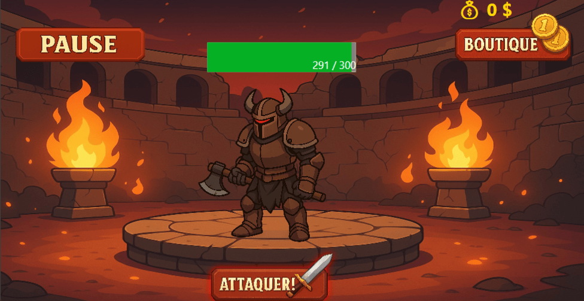

# Whack & Cash

## Nature et objectif de Whack & Cash
Whack & Cash est un projet de jeu de type clicker développé en C# avec WPF. Le jeu offre une expérience
simple et amusante. Le joueur doit cliquer afin de faire des dégâts aux ennemis provenant d'univers multiples,
gagner de l'argent et acheter des items pour devenir meilleur. Whack & Cash vous permet également d'avoir un
compte, afin de comparer vos performances aux autres, grâce à des leaderboard. Ce projet vise entre autres les 
joueurs de jeux vidéo, et plus particulièrement ceux qui aiment les clickers.
## Technologie utilisée
- C# (.NET 8.0), langage utilisé pour la logique du jeu.
- WPF (.NET 8.0), utilisé pour l'interface graphique, la gestion des fenêtres, les animations et les interactions de l'utilisateur.
- Visual Studio 2022, environnement de développement principal.
- SQL, stockage et gestion des données du jeu (les ennemis, les items, les univers, les joueurs et leurs sauvegarde).
## Fonctionnalités servies par Whack & Cash
- Système de combat clicker.
- Univers multiple.
  - Le joueur peut choisir plusieurs univers, personnalisant l'expérience visuelle et auditive du joueur.
- Boutique d'items.
- Gestion de compte.
  - Dans Whack & Cash, vous pouvez créer un compte, vous connecter, sauvegarder vos données et charger vos données.
- Leaderboard.
  - Deux leaderboards sont disponibles : un pour l'argent total accumulé et un autre pour le nombre d'ennemis total tués.
## Degré de complétion
Tout ce que je voulais faire pour Whack & Cash a été effectué avec succès !
## Bogues persistants
- Problème d'interface WPF, si on change la résolution de la fenêtre, ça ne suit pas.
## Possibles améliorations
- Rendre le choix de l'univers plus impactant visuellement et auditivement.
- Effets visuels plus avancés.
- Système de progression élargi.
## Procédure d'installation pour un joueur
1. Télécharger le fichier ZIP du jeu.
2. Décompresser le fichier ZIP.
3. Importer et installer la BD.
4. Lancer le jeu.
## Procédure d'installation pour un développeur
1. Cloner le dépôt GIT
2. Ouvrir le projet dans Visual Studio 2022.
     - Framework requis : .NET 8.0.
     - Package requis : MySqlConnector (by Bradley Grainger).
3. Importer le script SQL fourni et mettre à jour la chaîne de connexion si nécessaire.
